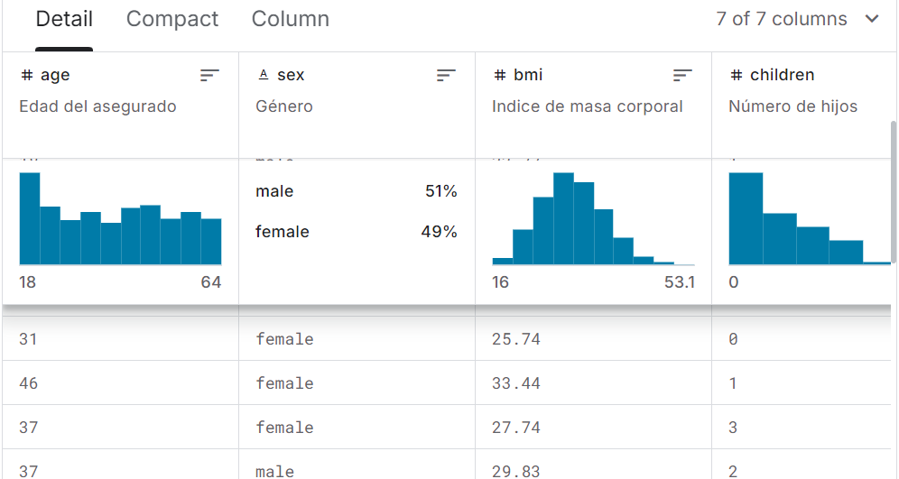

#  Medical Insurance Cost Prediction 💰🏥
## 📄 Overview
This repository contains a predictive model for estimating medical insurance costs based on personal factors like age, sex, number of children, and smoking habits. Built using Linear Regression, this project visualizes the relationships between these factors and insurance costs, making it both insightful and easy to interpret. 📊🔍

By visualizing the data using Matplotlib, this project provides an engaging look into how lifestyle choices and demographics can influence medical insurance costs. This tool can be incredibly useful for insurance companies, healthcare providers, or individuals who want to estimate their potential insurance expenses. 🏦💡




## 🔑 Key Features
- 📉 Linear Regression Model: Predicts medical insurance costs using a simple yet powerful machine learning technique.
- 👨‍👩‍👧 Personal Data Factors: Factors considered in the prediction include:
- Age 📅
- Sex 🧑👩
- Number of Children 👶
- Smoking Habits 🚬
- 📊 Data Visualization: Engaging graphs and plots created with Matplotlib to show how each factor correlates with insurance costs.
- 🛠️ Simple and Efficient: Lightweight and easy to run, with clearly structured code and visualization for an interactive experience.
## ⚙️ Tech Stack
- Python 🐍
- Linear Regression 🧩
- Pandas 🐼
- NumPy 🔢
- Matplotlib 📊 (for visualizing data)
## 🚀 How to Run the Project
1. Clone the Repository:
```
git clone https://github.com/Vedant3000/Medical-Insurace-Cost-Forecast-using-Linear-Regression.git
```
2. Install Dependencies:
```
pip install -r requirements.txt
```
3. Run the Prediction Model:
```
python insurance.ipynb
```
## View the Results:

The script will generate a series of plots that show the relationships between each factor (age, sex, children, smoking) and the predicted insurance cost. 📊
The predicted cost for each individual in the dataset will be displayed after running the model. 💼

## 📊 Visualizations
- Age vs Insurance Cost: See how age influences the cost of medical insurance as you grow older. 👵📈
- Number of Children vs Insurance Cost: Explore how having more children affects the overall cost. 👶👶📊
- Smoking Habit Impact: Discover the significant rise in insurance costs for smokers compared to non-smokers. 🚬⚠️

## 🎯 Model Accuracy
The Linear Regression model provides accurate predictions by fitting a line that best represents the relationships between the selected factors and insurance cost. The accuracy and model evaluation metrics are displayed after running the model. 🎯📈

## 🌟 Future Enhancements
- 🤖 Advanced Algorithms: Integrate more complex models like Random Forests or Gradient Boosting for even better prediction accuracy.
- 🌐 Web Interface: Develop a Flask or Streamlit web app to allow users to input their personal data and predict their insurance costs in real-time.
- 🧬 Additional Factors: Incorporate other potential factors, such as BMI or geographic location, for more granular predictions.
